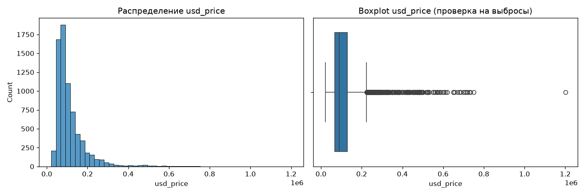
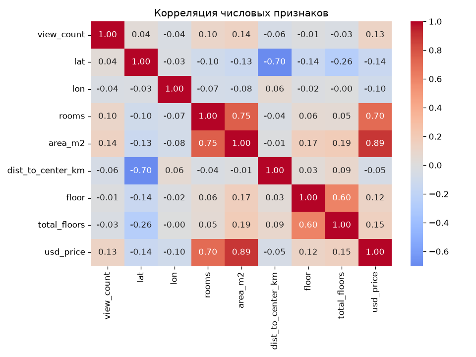
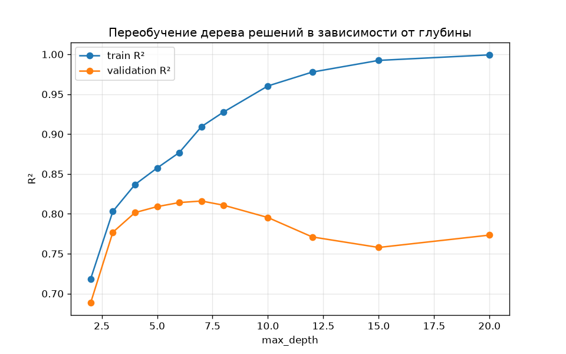
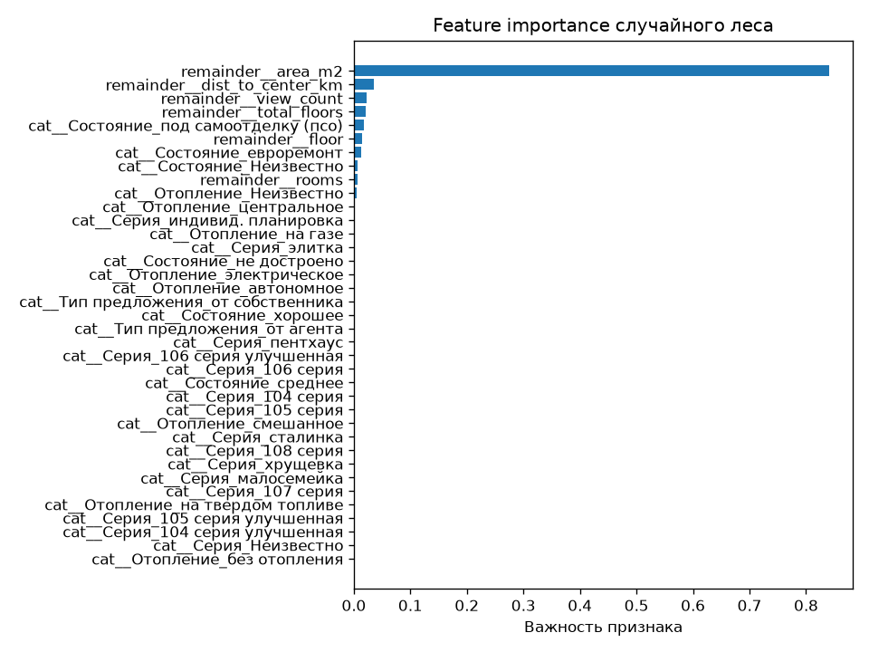
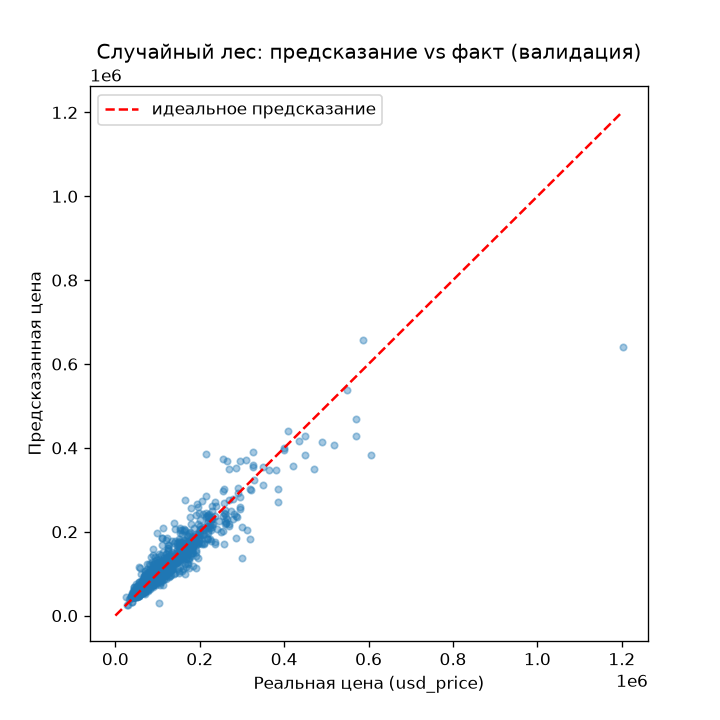

# Прогнозирование цен на квартиры в Бишкеке

Учебный проект: регрессия целевой переменной `usd_price` на данных объявлений о продаже квартир в Бишкеке (Kaggle, соревнование `forecast-of-apartment-prices-in-bishkek`).

Полный ход работы, весь код и все промежуточные решения — в [main.ipynb](main.ipynb). Этот README — краткий отчёт по итогам работы.

## Демо

Демо-приложение (Gradio): [ссылка на Hugging Face Space — добавить после публикации]

## Автор

[Имя Фамилия], курс Data Science.

## Окружение

- WSL (Ubuntu), Python 3.12.13, venv.
- Версии библиотек зафиксированы в [requirements.txt](requirements.txt): `pandas==3.0.3`, `numpy==2.5.0`, `scikit-learn==1.9.0`, `joblib==1.5.3`, `matplotlib==3.11.0`, `seaborn==0.13.2`.

## Данные

- `data/train.csv` — 7134 строки, 36 колонок, целевая `usd_price`.
- `data/test.csv` — 1784 строки, без `usd_price`, есть `id`.
- Много "грязных" текстовых колонок (`main`, `Этаж`, `Дом`, `Площадь`) и колонок с большим числом пропусков.

## Предобработка данных

1. **Пропуски.** Колонки с более чем 30% пропусков удалены (21 колонка: `Канализация`, `Электричество`, `Питьевая вода`, `Площадь участка`, `Возможность рассрочки`, `Возможность обмена`, `Пол`, `Телефон`, `Интернет`, `Возможность ипотеки`, `Парковка`, `Безопасность`, `Мебель`, `Балкон`, `Разное`, `Газ`, `Входная дверь`, `Санузел`, `Правоустанавливающие документы`, `Высота потолков`, `hearts`).
2. **Извлечение признаков из текста:**
   - из `main` (например, `"3-комн. кв., 113.8 м2"`) — `rooms` (количество комнат) и `area_m2` (площадь). `"6 и более комнат"` → 6, `"свободная планировка"` → пропуск (11 строк, обработаны медианой позже).
   - из `Этаж` (например, `"10 этаж из 12"`, `"цоколь из 9 этажей"`) — `floor` и `total_floors`. Цоколь/подвал приняты как этаж 0.
3. **Удалены колонки, непригодные для моделей:**
   - `main`, `Этаж` — после извлечения из них числовых признаков;
   - `address` (2361 уникальное значение — непрактично для `OneHotEncoder`, географию покрывают `lat`/`lon`);
   - `added` (текст вида "Добавлено N дней назад" — по сути замаскированное время, слабая корреляция с ценой даже после парсинга ≈0.14);
   - `upped` (аналогично, момент последнего поднятия объявления).
4. **Аномалия lat/lon.** Обнаружена и удалена 1 строка, где `lon` совпадал с `lat` (ошибка ввода данных, широта/долгота Бишкека не могут быть равны).
5. **Заполнение оставшихся пропусков** (перед обучением):
   - числовые (`rooms`, `floor`, `total_floors`) — медианой (посчитана по train, применена и к train, и к test — без утечки данных). Медиана выбрана вместо среднего, так как признаки дискретны и распределение скошено.
   - категориальные (`Отопление`, `Состояние`, `Серия`) — отдельной категорией `"Неизвестно"` вместо моды, так как пропуск, вероятно, означает, что продавец не указал параметр, и это не стоит выдумывать.
6. **Инженерный признак `dist_to_center_km`** — расстояние до центра города (формула гаверсинуса, центр — площадь Ала-Тоо). Для линейной регрессии эта фича не сильно помогла (корреляция ≈-0.05, слабее сырого `lat`), но полезна для дерева/леса.

## EDA: ключевые находки

**Распределение `usd_price`:** сильно скошено вправо (skewness ≈ 3.36) — медиана 88 700$, среднее 112 356$, диапазон 21 000$–1 202 000$. По правилу IQR выбросами считаются цены выше ≈224 050$ (~7% строк).

**Корреляция числовых признаков с ценой:** `area_m2` (0.89) и `rooms` (0.72) — явные лидеры, остальные признаки (`view_count`, `floor`, `total_floors`, `lat`) — слабые (0.10–0.15).

## Модели

Обучены три модели на одинаковой валидационной выборке (`test_size=0.2, random_state=42`), с кросс-валидацией (`KFold(5, shuffle=True, random_state=42)`).

### 1. Линейная регрессия

Признаки: `area_m2`, `rooms`, `floor`, `total_floors`, `lat`. `view_count` не включён (не свойство квартиры, а показатель вовлечённости), `lon`/`dist_to_center_km` не включены (нулевая/слабая корреляция с ценой).

Признаки не масштабировались (`StandardScaler` не применялся) — для обычного `LinearRegression` (метод наименьших квадратов, решается аналитически через `scipy.linalg.lstsq`, без итеративной оптимизации) это не влияет на точность прогноза.

**Проверка обработки выбросов `usd_price`** (4 варианта, при неизменной валидации):

| Вариант | R² | MAE | RMSE | MAPE |
|---|---|---|---|---|
| Без очистки | 0.80 | 21 476 | 33 721 | 19.7% |
| Выбросы убраны из train | 0.74 | 22 330 | 38 494 | 18.7% |
| Логарифмирование usd_price | -0.14 | 25 285 | 80 615 | 19.7% |
| Выбросы убраны + логарифмирование | -43.65 | 40 885 | 504 724 | 20.6% |

Вывод: лучше не трогать `usd_price` — чем сильнее чистим/трансформируем данные, тем хуже модель предсказывает дорогие квартиры на валидации (убирая примеры дорогого жилья из обучения, убираем и знание о нём).

### 2. Дерево решений

Признаки: числовые (`area_m2`, `rooms`, `floor`, `total_floors`, `view_count`, `dist_to_center_km`) + категориальные (`Тип предложения`, `Серия`, `Отопление`, `Состояние`) через `OneHotEncoder` + `ColumnTransformer` + `Pipeline`.

Подобрана глубина дерева (`max_depth`) по графику train/validation R² — оптимум `max_depth=6` (дальше train R² растёт до 1.0, а validation — падает, переобучение).

### 3. Случайный лес

Те же признаки. `n_estimators=200` (подобрано по плато `oob_score` при переборе 10–500), `oob_score=True` (бесплатная валидация на "не участвовавших" в дереве строках), `n_jobs=-1`, `random_state=42`.

## Итоговая сводка метрик

| Модель | R² | MAE | RMSE | MAPE |
|---|---|---|---|---|
| Линейная регрессия | 0.80 | 21 476 | 33 721 | 19.7% |
| Дерево решений (depth=6) | 0.81 | 18 323 | 32 564 | 15.7% |
| **Случайный лес (200 деревьев)** | **0.87** | **13 726** | **27 472** | **11.5%** |

**Вывод:** случайный лес — лучшая модель. Усреднение по многим деревьям сглаживает переобучение одного дерева и позволяет использовать больше признаков (включая слабые и категориальные) без риска подгонки под шум. По важности признаков во всех древовидных моделях доминирует `area_m2`, за ним — `Состояние` и `dist_to_center_km`.

**Про сохранённую модель (`model.pkl`):** метрики в таблице выше — для случайного леса с `n_estimators=200` без ограничения глубины. Для `model.pkl`, который загружен в GitHub и Hugging Face Space, взята чуть более компактная версия (`n_estimators=100, max_depth=12`) — 15.6 МБ вместо 97 МБ, чтобы файл проходил через веб-загрузку GitHub (лимит 25 МБ). Качество почти не отличается: R² 0.867 против 0.868.

## Структура репозитория

- `main.ipynb` — ноутбук с полным циклом: загрузка данных → EDA → предобработка → обучение → метрики → сохранение модели.
- `model.pkl` — обученная модель (случайный лес, `Pipeline` с `OneHotEncoder`).
- `app.py` — демо-приложение (Gradio) для Hugging Face Space.
- `requirements.txt` — зависимости.
- `README.md` — этот файл.
- `images/` — графики для отчёта.
- `data/` — исходные данные (`train.csv`, `test.csv`, `sample_submission.csv`).
